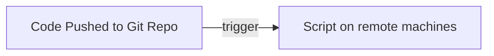

<!-- Now, if you haven't heard about Continuous Integration, let me give you the gist: 

- you **push code to a git repository**, and then **some script runs on a machine far away from you** in a data center.

Let's see a basic CI workflow for small app.

I'm going to go through the tools we are using for developing this app.
-->