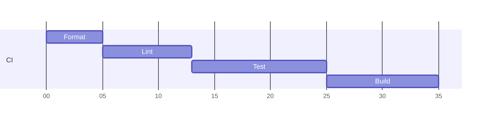
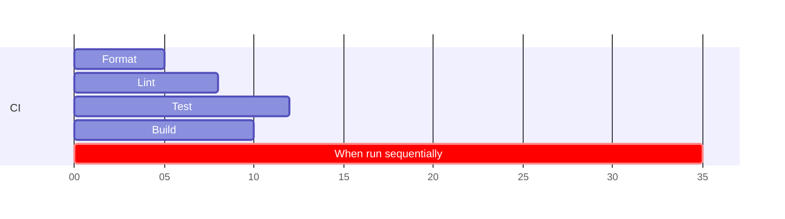

```mermaid
gantt 
    axisFormat  %S
    section CI
    Format           :a1, 2014-01-01, 5s
    Lint             :a2, after a1, 8s
    Test             :a3, after a2, 12s
    Build            :after a3, 10s
```

<v-click>

```mermaid
gantt
    axisFormat  %S
    section CI
    Format           :2014-01-01, 5s
    Lint             :2014-01-01, 8s
    Test             :2014-01-01, 12s
    Build            :2014-01-01, 10s
    When run sequentially            :crit, 2014-01-01, 35s
```
</v-click>